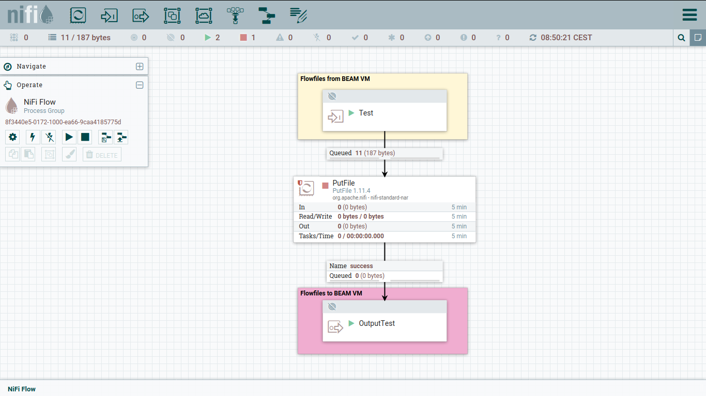

# nifi_s2s

nifi_s2s is an Erlang implementation of NiFi Site-to-Site flowfile transfer protocol.

If you are not aware about what does NiFi mean, please take a look in the official [Apache NiFi project](https://nifi.apache.org).

This library only makes sense if you need to transfer data from and to NiFi node or cluster.

## Overview

[Apache NiFi](https://nifi.apache.org) is a tool aim to automate the flow of data between systems. The tool brings valuable features that allows moving data around secondary systems.

[NiFi Site to Site Protocol](https://nifi.apache.org/docs/nifi-docs/html/user-guide.html#site-to-site) is a native NiFi protocol which can be used in order to transfer flowfiles between systems.

The intention of this application library (nifi_s2s) is to provide a site-to-site Erlang client implementation where flowfiles can be transferred or received.

The figure below shows a common use case where a device transfers data to a central NiFi node:

<!---
@startuml
node "IoT Device" as d
node "Nifi Node" as n
node "Server" as s

d -r-> n : Site to Site\nraw
n .r.> s : Site to Site\nhttp
@enduml
-->


Currently, there are a few NiFi Site-to-Site implementations, none targeting BEAM VM. The most important are:

 * [Java](https://github.com/apache/nifi/tree/master/nifi-commons/nifi-site-to-site-client/src/main/java/org/apache/nifi/remote/client)
 * [C++](https://github.com/apache/nifi-minifi-cpp/tree/master/libminifi/src/sitetosite)
 * [C](https://github.com/apache/nifi-minifi-cpp/tree/master/nanofi/src/sitetosite)

All of the above implementations are from NiFi official project.

This application library provides an Erlang site-to-site client which could be used to connect and send data to and from NiFi nodes or clusters.

The figure below shows a typical NiFi flowfile which there are three processors:

 * receiving flowfiles using a port
 * writing each flowfiles to file
 * sending each flowfile to remote port



## Design

This library follows the common site-to-site protocol sequence as described in [NiFi System Administrator’s Guide](https://nifi.apache.org/docs/nifi-docs/html/administration-guide.html#site-to-site-protocol-sequence).

There are two state machines which encapsulates all the site-to-site protocol:

* `nifi_s2s_raw_protocol_statem`: in charge of controlling the initial connection to NiFi instance and also establishing the Peer connection
* `nifi_s2s_transaction_statem`: responsible for creating and control the transaction state when sending or receiving flowfiles.

The main user level interface is implemented by the module `nifi_s2s`. The rest of the code are just about help functions and encode/decode helpers.


## How to use

This client exports to main functions to transfer and receive flowfiles. 

The follow example show how to create a client which uses the raw protocol and transfer
a flowfile to a Peer (that is a NiFi node):

```
    S2SConfig = #{hostname => "localhost",
                  port => 8080,
                  transport_protocol => raw,
                  local_network_interface => "lo0",
                  port_id => ?config(input_port, Config)},

    {ok, Pid} = nifi_s2s:create_client(S2SConfig),

    Content = <<"Test Nifi Content">>,
    Attributes = #{ <<"TEST1">> => <<"Test">>},

    Flowfiles = nifi_flowfile:add(Attributes, Content, nifi_flowfile:new())

    ok = nifi_s2s:transfer_flowfiles(Pid, Flowfiles),

    ok = nifi_s2s:close(Pid).
```

Now, in order to receive flowfiles from the remote Peer:

```
    {ok, _Flowfiles} = nifi_s2s:receive_flowfiles(Pid).
```

## Build

```
rebar3 compile
```

## Test

In order to run unit tests:

```
rebar3 eunit
```

However, to run integration tests the approach is to have a running NiFi instance on the developer machine and import the template `samples/Input_and_Output_Flowfiles.xml`. Having it imported and started is necessary when running integration tests. After that, run:

```
rebar3 ct
```

## TODO

- [x] Sending and receiving flowfiles
- [] Add internal metrics
- [] Add SSL context
- [] Add suport to compress flowfile
- [] Add http protocol
- [] Improve the state machine and use push and pop callbacks from statem
- [] Improve test code coverage to get edge cases
- [] Add supervisor tree
- [] Implement peer work checks and reconnect to the less busy peer
- [] Add Peer list persistent file
- [] Add async receive and transfer flowfiles API

## License

[MIT](https://spdx.org/licenses/MIT.html)
